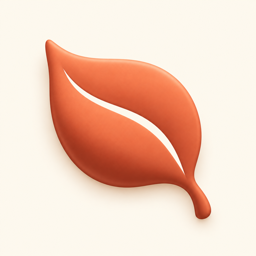
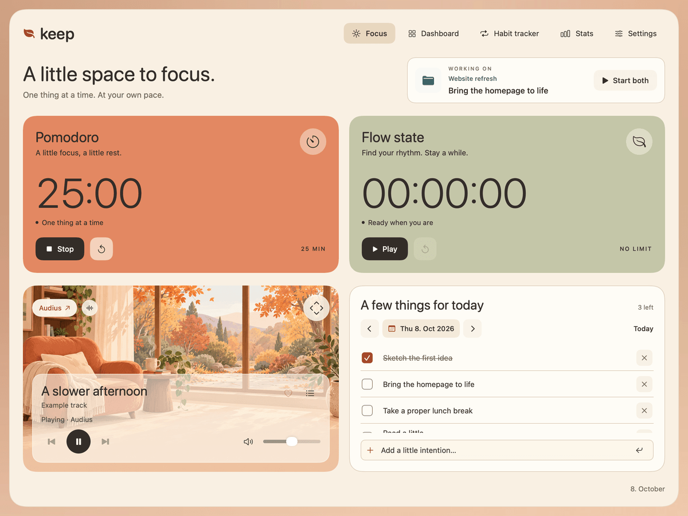
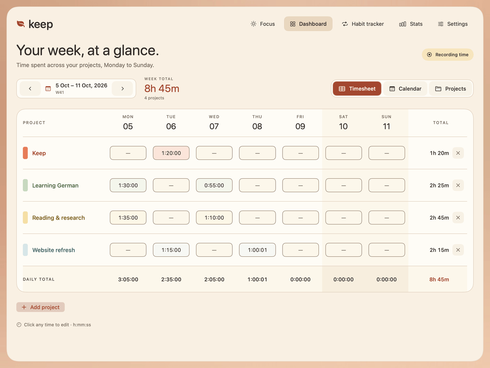
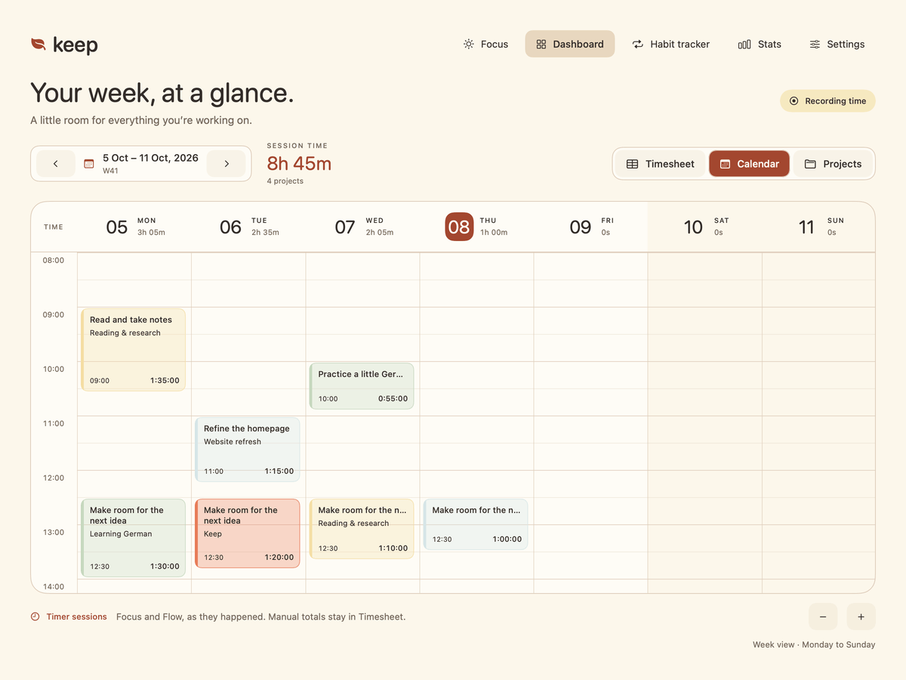
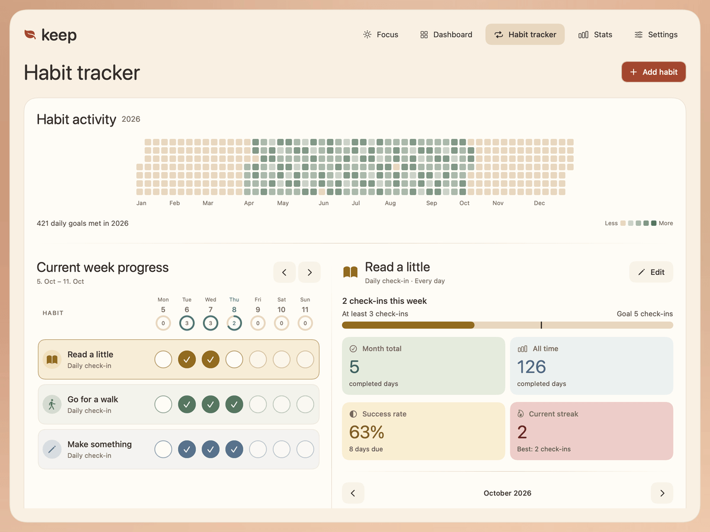
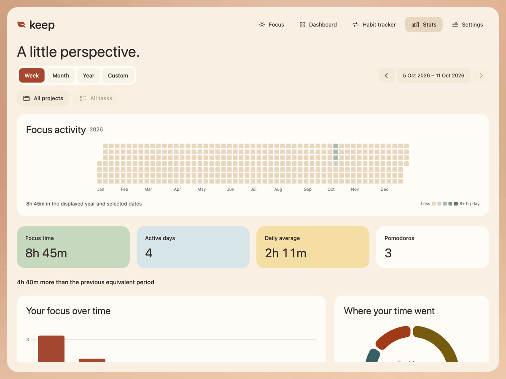
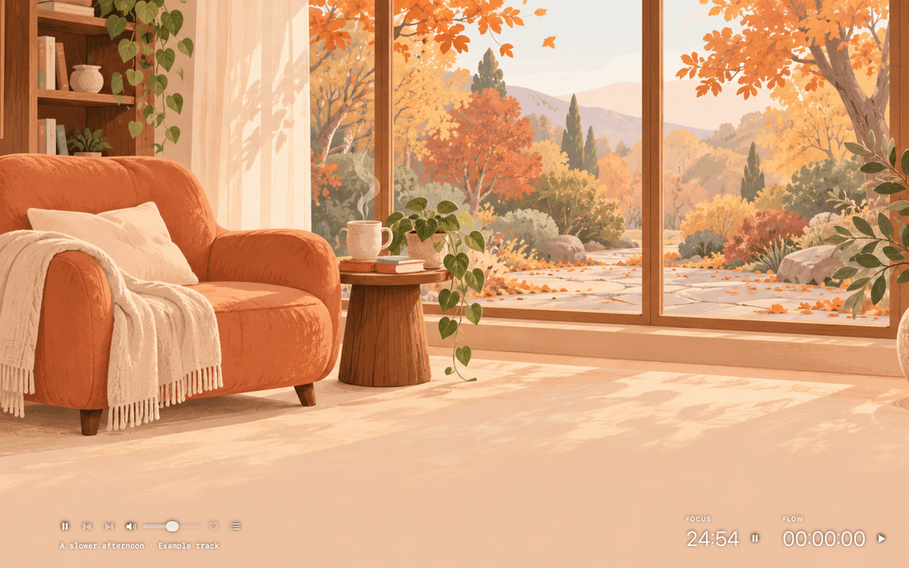
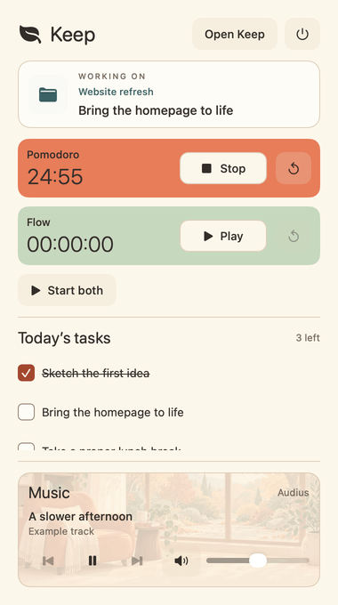
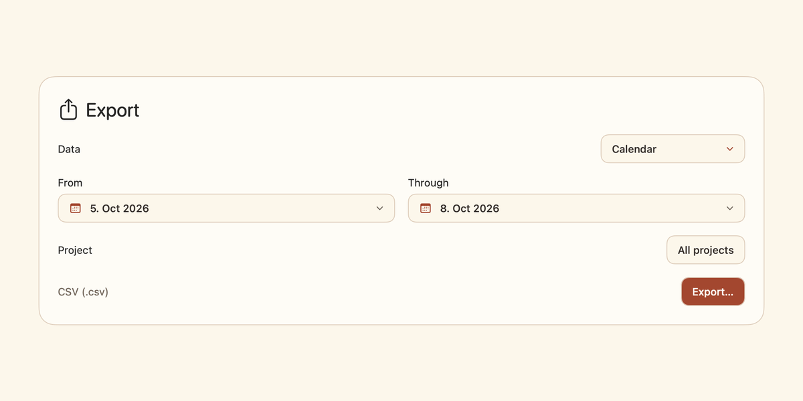

<p align="center">
  
</p>

<h1 align="center">Keep</h1>

<p align="center">
  A little space to focus. One thing at a time.<br>
  Timers, tasks, music, and a clearer view of your week. Built for Mac. Every feature is free.
</p>

<p align="center">
  <a href="#everything-it-does">Features</a> ·
  <a href="#install">Install</a> ·
  <a href="#private-by-default">Privacy</a> ·
  <a href="#build-it-yourself">Build</a> ·
  <a href="#documentation">Documentation</a> ·
  <a href="https://github.com/youssefezzat304/keep/issues">Feedback</a>
</p>

<p align="center">
  <a href="#what-you-need"></a>
  
  
</p>

Keep brings your current project, focus timers, daily tasks, and music into one native macOS workspace. Start a structured Pomodoro or an open-ended Flow session, then see where your time went in the Dashboard. Build habits, set goals, and take your records with you when you need them.

<p align="center">
  
</p>

<p align="center"><sub>App screenshots show example projects and activity.</sub></p>

## Everything it does

### Make room for focus

- **Pomodoro and Flow.** Use a countdown with short and long breaks, or a timer without a time limit. Pause, resume, and reset each independently.
- **Projects and tasks.** Choose what you’re working on, pin frequent tasks, and record time against a project. Both timers can run together without counting the same time twice.
- **Daily intentions.** Keep dated task lists, check things off, and start a timer directly from today’s tasks. Scheduled habits appear here too.

### See your week in the Dashboard

- **Timesheet.** Review daily and weekly project totals, browse past weeks, and edit time when you need to make a correction.
- **Calendar.** See recorded timer sessions laid out across the week. Inspect a session, adjust its times, or remove it.
- **Projects.** Organize your work with named, color-coded projects and weekly targets.

<p align="center">
  
  
</p>

### Build habits and work toward goals

- **Habit tracker.** Choose the weekdays that matter, track check-ins, minutes, or repetitions, and see your activity throughout the year.
- **Goals.** Set an overall weekly focus goal, project time targets, and daily or weekly habit targets. Follow your progress as you work.
- **Stats.** Explore focus time, completed Pomodoros, streaks, task and habit activity, and how your time is divided. Filter by project, task, or date range and compare periods.

<p align="center">
  
  
</p>

### Find your soundtrack, then settle into Zen

- **Music player.** Listen to lo-fi and ambient selections through Audius, save public artists and playlists, or browse and control your library in the Mac’s Music app.
- **Zen mode.** Fill the screen with your own image or MP4 wallpapers, with small timer and music controls close at hand. Choose wallpaper rotation or stay with one scene.
- **Your atmosphere.** Switch between Light, Dark, and System appearance and adjust the frosted music controls to suit your wallpaper.

Keep’s music controls are free. Content available through the Mac’s Music app depends on your library and any subscription required by that service.

<p align="center">
  
</p>

### Stay close to your work and keep your records

- **Menu bar.** Reach your timers, today’s tasks, active project, and music without returning to the main window. Enable Start on login if you want Keep ready each morning.
- **Exports.** Save Calendar sessions or Timesheet totals as CSV, or export a ZIP of Stats CSV reports. Choose your date range and project before saving.
- **Free features.** Timers, Dashboard, habits, goals, Stats, music controls, Zen, and exports are all included, with no Keep subscription or paid tier.

<p align="center">
  
</p>

<p align="center">
  
</p>

## Install

The first public release is being prepared. Check [GitHub Releases](https://github.com/youssefezzat304/keep/releases) for availability; there is no published installer yet.

For now, [build Keep locally](#build-it-yourself). DMG downloads and Homebrew installation instructions will be added when those distribution channels are ready.

## Uninstall

Quit Keep, then move the app from Applications to the Trash. This removes the application; saved local history and preferences are retained.

## Private by default

Your projects, recorded sessions, tasks, habits, and preferences are saved locally on your Mac. Keep does not require a Keep account, and its core focus and tracking features work offline.

Music streaming and software-update checks use network connections. The Mac Music integration requests Automation access, and personal wallpapers use read-only access to a folder you select. Export files are written to a location you choose.

See the [architecture and capability notes](docs/architecture.md#7-build-configuration-and-capabilities) for implementation details. Optional iCloud backup setup and its remaining distribution checks are documented separately in the [backup guide](docs/backups.md).

## What you need

- A Mac running **macOS 15 Sequoia or newer**.
- An internet connection for Audius streaming and software updates.
- The Mac’s Music app and Automation permission if you use its library integration.

### Build it yourself

Install full Xcode with a macOS SDK compatible with the project. See the [build workflow](docs/architecture.md#8-development-and-verification) for the verified toolchain and available checks.

```sh
git clone https://github.com/youssefezzat304/keep.git
cd keep
open keep.xcodeproj
```

Choose the **keep** scheme in Xcode and run the app. For an unsigned compilation check from the repository root:

```sh
xcodebuild -project keep.xcodeproj -scheme keep -configuration Debug \
  -destination 'platform=macOS' -derivedDataPath /tmp/keep-derived-data \
  CODE_SIGNING_ALLOWED=NO build
python3 Tools/run-app-checks.py UpdaterChecks
```

For a repeatable ad-hoc-signed build without an Apple certificate:

```sh
Tools/build.sh --check UpdaterChecks
Tools/build.sh --configuration Release --ad-hoc
Tools/package-release.sh --tag v1.0.0
```

Use the version configured in Xcode for the tag. The scripts prepare a DMG,
signed Sparkle appcast, and checksums under `dist/`; they do not publish a release.
Run either with `--help` for options, including custom build/output paths.

An unsigned local build checks compilation. Release signing, notarization, and real update installation require separate verification; see the [Sparkle release guide](docs/updates.md).

<details>
<summary>Project layout</summary>

```text
Sources/Keep/
  App/          App assembly, shell and lifecycle
  Core/         Value types, timer rules and aggregation
  Services/     Shared stores, persistence and native integrations
  UI/           Feature views, presentation models and DesignSystem
  Support/      Preview fixtures
Resources/      Assets, Info.plist, entitlements and third-party notices
Configuration/ Public update configuration
Tests/          Standalone checks
Tools/          Development tools
docs/           Architecture, decisions, style and release instructions
website/        Independent Next.js product website
keep.xcodeproj/ Xcode project and keep scheme
```

Keep remains one native application module. The website is separate from the app’s bundled resources.

</details>

### Run the website locally

Use Node.js 22.12 or newer:

```sh
cd website
npm ci
npm run dev
```

Open <http://127.0.0.1:3000>. See the [website guide](website/README.md) for screenshot capture, checks, and static hosting.

## When something misbehaves

Report a bug in [GitHub Issues](https://github.com/youssefezzat304/keep/issues), including your macOS version, Keep version, what you expected, and the steps to reproduce it. Please remove personal task names and other private information from attached screenshots or logs.

## Documentation

- [Architecture](docs/architecture.md) — source boundaries, implemented behavior, capabilities, and build checks.
- [Decisions](docs/decisions.md) — current state, durable decisions, and unresolved questions.
- [Visual style](docs/style.md) — Keep’s palette, typography, and native UI conventions.
- [Exports](docs/exports.md) — report formats, filters, and CSV fields.
- [Backups](docs/backups.md) — optional backup behavior and setup requirements.
- [Updates and releases](docs/updates.md) — Sparkle configuration, signing, and publishing.
- [Website](website/README.md) — local development, app captures, and hosting.

## Community

Bug reports, feature ideas, and pull requests are welcome through [GitHub](https://github.com/youssefezzat304/keep). Read the [project guidance](AGENTS.md) and architecture notes before making a substantial change.

## Acknowledgements

- [Sparkle](https://sparkle-project.org/) powers macOS software updates. Its bundled license is in [third-party notices](Resources/ThirdPartyNotices/Sparkle.txt).
- [Audius](https://audius.co/) provides public music discovery and streaming.

## License

Keep is licensed under the [MIT License](LICENSE.md), copyright © 2026 Youssef Abdelrahim. Third-party components retain their respective licenses.

<p align="center">
  <sub>Made by <a href="https://github.com/youssefezzat304">Youssef</a></sub>
</p>
